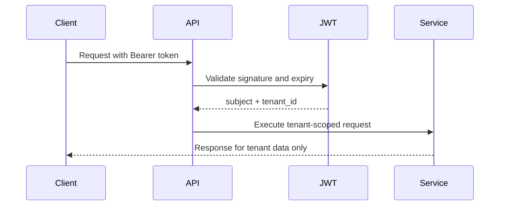

# Shipment Tracking API Design

## Authentication

Clients authenticate with a signed JWT:

```text
Authorization: Bearer <jwt>
```

The token must include a `tenant_id` claim. Every repository query is scoped by that tenant so one company cannot retrieve another company's shipments, events, webhooks, or delivery logs.



## Rate Limiting

Default limit: `1000` requests per minute per tenant. The application enforces this with a tenant/minute counter and returns `429 Too Many Requests` when exceeded. The database schema includes `api_rate_limits` for a durable/distributed implementation.

## Validation Rules

- `eventType` must be one of `PICKUP`, `IN_TRANSIT`, `OUT_FOR_DELIVERY`, `DELIVERED`, `EXCEPTION`, `CANCELLED`.
- `timestamp` is required and must be ISO-8601.
- `location.latitude` must be between `-90` and `90`.
- `location.longitude` must be between `-180` and `180`.
- `location.address` is required.
- Webhook `secret` must be 16-200 characters.
- Webhook `eventTypes` cannot be empty.

## Error Codes

| Code | Meaning |
| --- | --- |
| 400 | Invalid JSON, validation failure, unsupported enum value |
| 401 | Missing, expired, or invalid JWT |
| 404 | Shipment or webhook not found for the authenticated tenant |
| 429 | Tenant exceeded configured rate limit |
| 500 | Unexpected server error |

## OpenAPI 3.0

```yaml
openapi: 3.0.3
info:
  title: Real-Time Shipment Tracking API
  version: 1.0.0
servers:
  - url: http://localhost:8081
security:
  - bearerAuth: []
paths:
  /api/v1/shipments/{shipmentId}/events:
    post:
      summary: Record a shipment event
      parameters:
        - $ref: '#/components/parameters/ShipmentId'
      requestBody:
        required: true
        content:
          application/json:
            schema:
              $ref: '#/components/schemas/ShipmentEventRequest'
            examples:
              inTransit:
                value:
                  eventType: IN_TRANSIT
                  timestamp: '2026-04-17T14:30:00Z'
                  location:
                    latitude: 40.7128
                    longitude: -74.0060
                    address: New York, NY
                  metadata:
                    carrier: FastFreight
                    vehicle: TRUCK-789
      responses:
        '201':
          description: Event recorded
          content:
            application/json:
              schema:
                $ref: '#/components/schemas/ShipmentEventResponse'
        '400':
          $ref: '#/components/responses/BadRequest'
        '401':
          $ref: '#/components/responses/Unauthorized'
        '429':
          $ref: '#/components/responses/TooManyRequests'
    get:
      summary: Retrieve shipment event history
      parameters:
        - $ref: '#/components/parameters/ShipmentId'
        - name: page
          in: query
          schema: { type: integer, minimum: 0, default: 0 }
        - name: size
          in: query
          schema: { type: integer, minimum: 1, maximum: 200, default: 50 }
      responses:
        '200':
          description: Paged event history
          content:
            application/json:
              schema:
                $ref: '#/components/schemas/PagedShipmentEvents'
        '401':
          $ref: '#/components/responses/Unauthorized'
        '404':
          $ref: '#/components/responses/NotFound'
  /api/v1/shipments/{shipmentId}/status:
    get:
      summary: Get current shipment status
      parameters:
        - $ref: '#/components/parameters/ShipmentId'
      responses:
        '200':
          description: Current shipment state
          content:
            application/json:
              schema:
                $ref: '#/components/schemas/ShipmentStatusResponse'
        '401':
          $ref: '#/components/responses/Unauthorized'
        '404':
          $ref: '#/components/responses/NotFound'
  /api/v1/webhooks:
    post:
      summary: Register a webhook subscription
      requestBody:
        required: true
        content:
          application/json:
            schema:
              $ref: '#/components/schemas/WebhookRequest'
      responses:
        '201':
          description: Webhook registered
          content:
            application/json:
              schema:
                $ref: '#/components/schemas/WebhookResponse'
        '400':
          $ref: '#/components/responses/BadRequest'
        '401':
          $ref: '#/components/responses/Unauthorized'
  /api/v1/webhooks/{webhookId}:
    delete:
      summary: Unregister a webhook subscription
      parameters:
        - name: webhookId
          in: path
          required: true
          schema: { type: string, format: uuid }
      responses:
        '204':
          description: Webhook deactivated
        '401':
          $ref: '#/components/responses/Unauthorized'
        '404':
          $ref: '#/components/responses/NotFound'
components:
  securitySchemes:
    bearerAuth:
      type: http
      scheme: bearer
      bearerFormat: JWT
  parameters:
    ShipmentId:
      name: shipmentId
      in: path
      required: true
      schema: { type: string, example: SHP-12345 }
  responses:
    BadRequest:
      description: Request failed validation
      content:
        application/json:
          schema: { $ref: '#/components/schemas/ApiError' }
    Unauthorized:
      description: JWT is missing or invalid
    NotFound:
      description: Resource not found for authenticated tenant
      content:
        application/json:
          schema: { $ref: '#/components/schemas/ApiError' }
    TooManyRequests:
      description: Tenant exceeded rate limit
  schemas:
    ShipmentEventRequest:
      type: object
      required: [eventType, timestamp, location]
      properties:
        eventType:
          type: string
          enum: [PICKUP, IN_TRANSIT, OUT_FOR_DELIVERY, DELIVERED, EXCEPTION, CANCELLED]
        timestamp:
          type: string
          format: date-time
        location:
          $ref: '#/components/schemas/Location'
        metadata:
          type: object
          additionalProperties: { type: string }
        estimatedDeliveryAt:
          type: string
          format: date-time
        condition:
          type: string
    Location:
      type: object
      required: [latitude, longitude, address]
      properties:
        latitude: { type: number, format: double }
        longitude: { type: number, format: double }
        address: { type: string }
    ShipmentEventResponse:
      type: object
      properties:
        eventId: { type: string, example: EVT-550e8400-e29b-41d4-a716-446655440000 }
        shipmentId: { type: string, example: SHP-12345 }
        eventType: { type: string, example: IN_TRANSIT }
        timestamp: { type: string, format: date-time }
        location: { type: string }
        metadata: { type: string }
    ShipmentStatusResponse:
      type: object
      properties:
        shipmentId: { type: string }
        currentStatus: { type: string }
        latestLocation: { type: string }
        estimatedDeliveryAt: { type: string, format: date-time }
        condition: { type: string }
        carrier: { type: string }
        updatedAt: { type: string, format: date-time }
    WebhookRequest:
      type: object
      required: [targetUrl, secret, eventTypes]
      properties:
        targetUrl: { type: string, format: uri }
        secret: { type: string, minLength: 16, maxLength: 200 }
        eventTypes:
          type: array
          items:
            type: string
            enum: [PICKUP, IN_TRANSIT, OUT_FOR_DELIVERY, DELIVERED, EXCEPTION, CANCELLED]
    WebhookResponse:
      type: object
      properties:
        webhookId: { type: string, format: uuid }
        targetUrl: { type: string }
        eventTypes: { type: string }
        active: { type: boolean }
        createdAt: { type: string, format: date-time }
    PagedShipmentEvents:
      type: object
      properties:
        content:
          type: array
          items: { $ref: '#/components/schemas/ShipmentEventResponse' }
        totalElements: { type: integer }
        totalPages: { type: integer }
        size: { type: integer }
        number: { type: integer }
    ApiError:
      type: object
      properties:
        timestamp: { type: string, format: date-time }
        status: { type: integer }
        error: { type: string }
        message: { type: string }
        validationErrors:
          type: object
          additionalProperties: { type: string }
```
