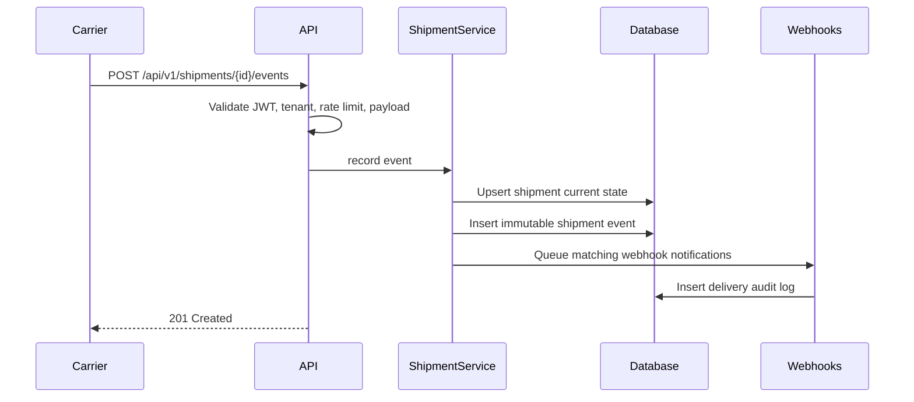

# Architecture

## Overview

This service implements the required real-time shipment tracking API with a conventional Spring Boot layered architecture:

- Controllers expose `/api/v1` REST endpoints.
- Security filters validate JWTs, extract `tenant_id`, and enforce per-tenant rate limits.
- Services coordinate shipment/event writes, status updates, tenant checks, and webhook delivery logging.
- Repositories use Spring Data JPA against PostgreSQL.
- The schema is designed for high event volume with tenant-aware composite indexes and range partitioning by event timestamp.

## Data Model

- `shipments`: current state for fast status reads.
- `shipment_events`: immutable event history. Events are appended only and queried by `(tenant_id, shipment_id, timestamp)`.
- `webhooks`: tenant-scoped subscriptions.
- `webhook_delivery_logs`: audit trail for notification attempts.
- `api_rate_limits`: durable table design for distributed rate limiting.

## Multi-Tenancy

Tenant isolation is enforced at the application boundary and repository layer:

1. JWT authentication extracts `tenant_id`.
2. Controllers never accept tenant IDs from request bodies or path parameters.
3. Services pass the authenticated tenant to repository methods.
4. Repository methods query by shipment/webhook ID plus tenant ID.

## Event Flow

## Scale Considerations

For 10,000+ events per minute:

- Append-only events avoid update contention.
- Current shipment status is denormalized in `shipments` for fast reads.
- Event history queries use `(tenant_id, shipment_id, timestamp DESC)`.
- PostgreSQL range partitioning keeps old event partitions manageable.
- JSONB indexes support carrier metadata and location-oriented troubleshooting.
- Webhook delivery is represented as a queue/audit log so real delivery can be processed asynchronously.

## Security

- Stateless JWT authentication.
- Per-tenant rate limiting.
- Bean Validation for request input.
- JPA repository methods and parameter binding reduce SQL injection risk.
- No database credentials are hard-coded; runtime config is environment-driven.

## Testing Strategy

- Unit tests cover service behavior with JUnit 5 and Mockito.
- MockMvc tests cover endpoint behavior, validation, auth, tenant isolation, webhooks, and rate limiting.
- A TestContainers PostgreSQL integration test is included and can be enabled with `RUN_TESTCONTAINERS=true`.
